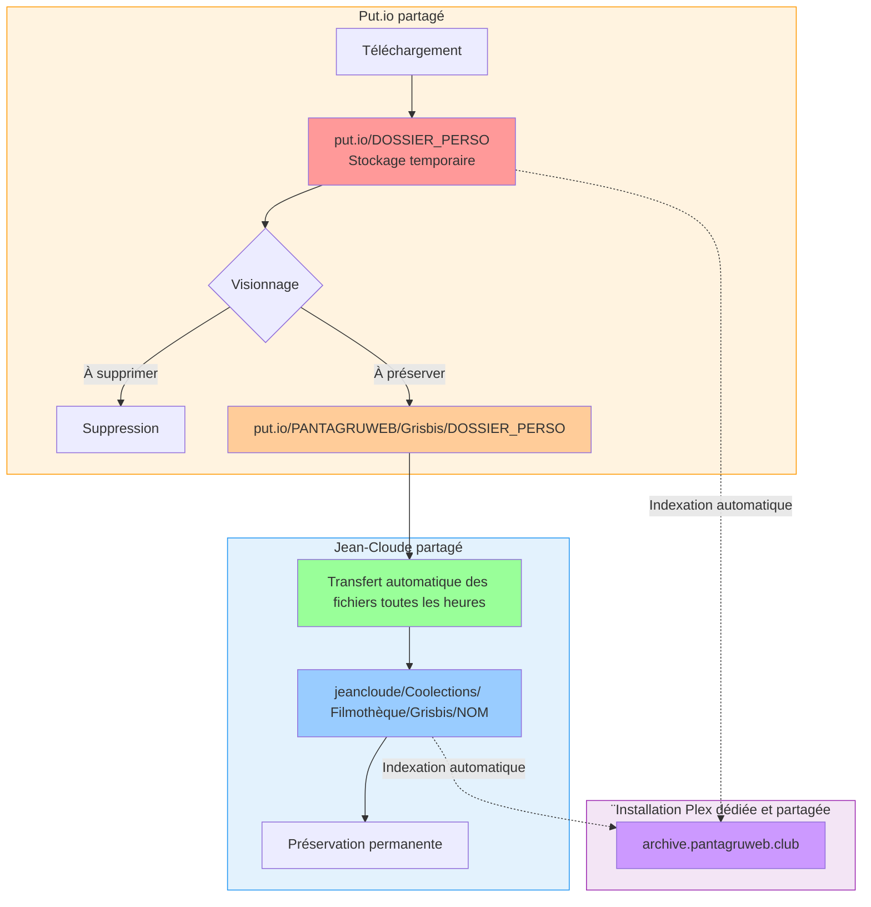

```mermaid
flowchart TD
    subgraph USER["Put.io partagé"]
        A[Téléchargement] --> B["put.io/DOSSIER_PERSO
            Stockage temporaire"]
        B --> C{Visionnage}
        C -->|À supprimer| D[Suppression]
        C -->|À préserver| E["put.io/PANTAGRUWEB/Grisbis/DOSSIER_PERSO"]
    end

    E --> F[Transfert automatique des fichiers toutes les heures]

    subgraph SHARED["Jean-Cloude partagé"]
        F --> G["jeancloude/Coolections/ Filmothèque/Grisbis/NOM"]
        G --> I[Préservation permanente]
    end

    subgraph PLEX["¨Installation Plex dédiée et partagée"]
        H[archive.pantagruweb.club]
    end

    B -.->|Indexation automatique| H
    G -.->|Indexation automatique| H

    style B fill:#ff9999
    style E fill:#ffcc99
    style G fill:#99ccff
    style H fill:#cc99ff
    style F fill:#99ff99
    style USER fill:#fff3e0,stroke:#ff9800
    style SHARED fill:#e3f2fd,stroke:#2196f3
    style PLEX fill:#f3e5f5,stroke:#9c27b0
```