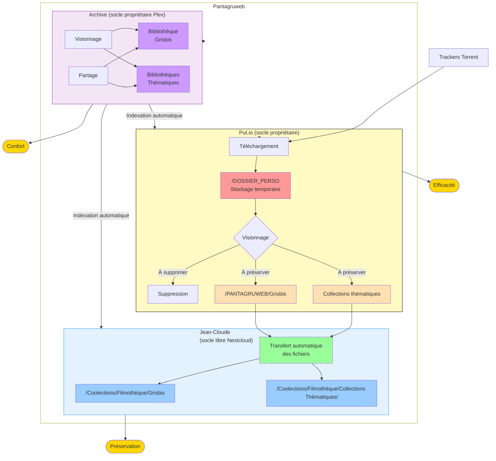

## Vue d'ensembre

```mermaid
flowchart TB
    A3["Trackers Torrent"] --> A
    subgraph PUTIO["Put.io (socle propriétaire)"]
        B["/DOSSIER_PERSO
                Stockage temporaire"]
        A["Téléchargement"]
        C{"Visionnage"}
        D["Suppression"]
        E["/PANTAGRUWEB/Grisbis"]
        A2["Collections thématiques"]
    end
    subgraph NEXTCLOUD["Jean-Cloude
    (socle libre Nextcloud)"]
        G1["/Coolections/Filmothèque/Grisbis"]
        F1["Transfert automatique
        des fichiers"]
        G2["/Coolections/Filmothèque/Collections Thématiques/"]
    end
    subgraph PLEX["Archive (socle propriétaire Plex)"]
        H1["Bibliothèque
        Grisbis"]
        H2["Bibliothèques
        Thématiques"]

        J1["Visionnage"] --> H1
        J1["Visionnage"] --> H2
        J2["Partage"] --> H1
        J2["Partage"] --> H2
    end
    subgraph PANTAGRUWEB["Pantagruweb"]
        PUTIO
        NEXTCLOUD
        PLEX
    end
    A --> B
    B --> C
    C -- À supprimer --> D
    C -- À préserver --> E & A2
    E --> F1
    F1 --> G1 & G2
    PLEX --> PANTAGRUWEB & PANTAGRUWEB & n2(["Confort"])
    PUTIO --> PANTAGRUWEB & n3(["Efficacité"])
    A2 --> F1
    PLEX -- Indexation automatique --> NEXTCLOUD & PUTIO
    NEXTCLOUD --> n4(["Préservation"])
    style B fill:#ff9999
    style E fill:#FFE0B2
    style A2 fill:#FFE0B2
    style G1 fill:#99ccff
    style F1 fill:#99ff99
    style G2 fill:#99ccff
    style H1 fill:#cc99ff
    style H2 fill:#cc99ff
    style PUTIO stroke:#000000,fill:#FFF9C4
    style NEXTCLOUD fill:#e3f2fd,stroke:#2196f3
    style PLEX fill:#f3e5f5,stroke:#9c27b0
    style PANTAGRUWEB color:none,fill:transparent
    style n2 fill:#FFD600
    style n3 fill:#FFD600
    style n4 fill:#FFD600
```

## Organisation

### Les Collections Thématiques

### Les Grisbis

## Les Outils

### Put.io

### Jean-Cloude

### Archives
